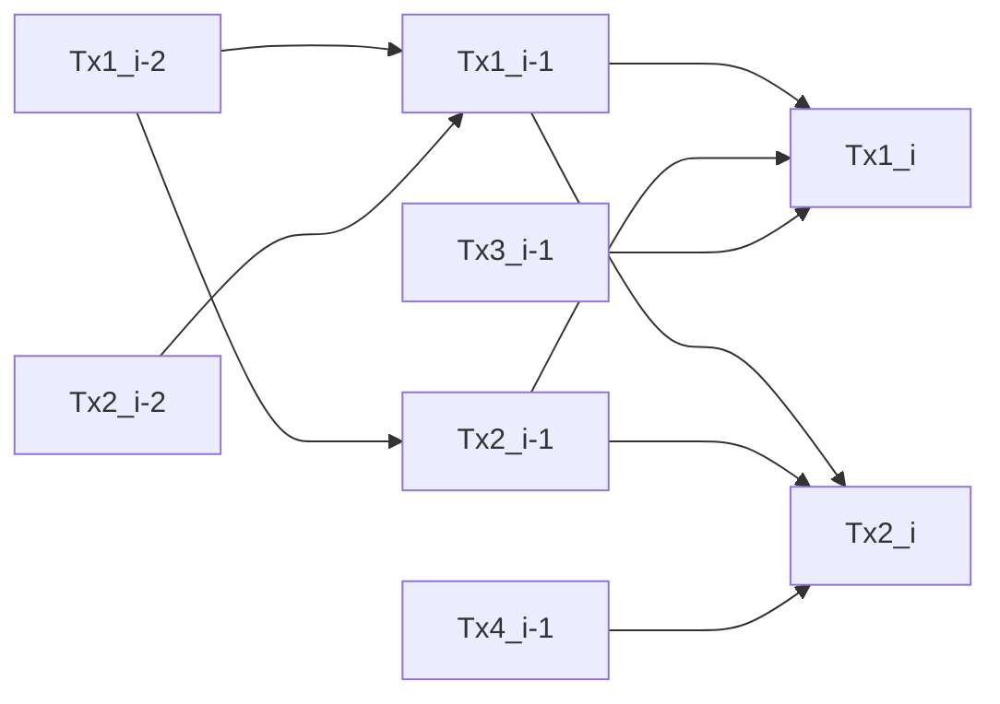

### Wyvern

*Wyvern* is a **DAG** with smart-contracts on **WASM**

Each transaction has a **fee** and list of **predecessors** - transactions that were verified by the sender (possibly their **predecessors** too) - this way you confirm previous transactions and take **fee** fraction (transactions share their predecessors and thus fee is splitted)

System **state** is determined per-transaction, predecessors are ordered by `fee/execution_cost`,
where execution cost is time in ms

You always want to peek transactions with higher fractions
